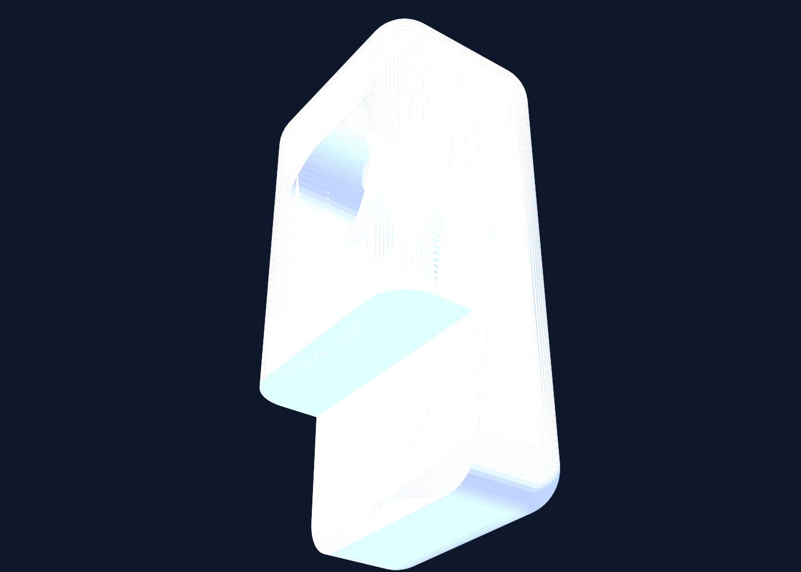
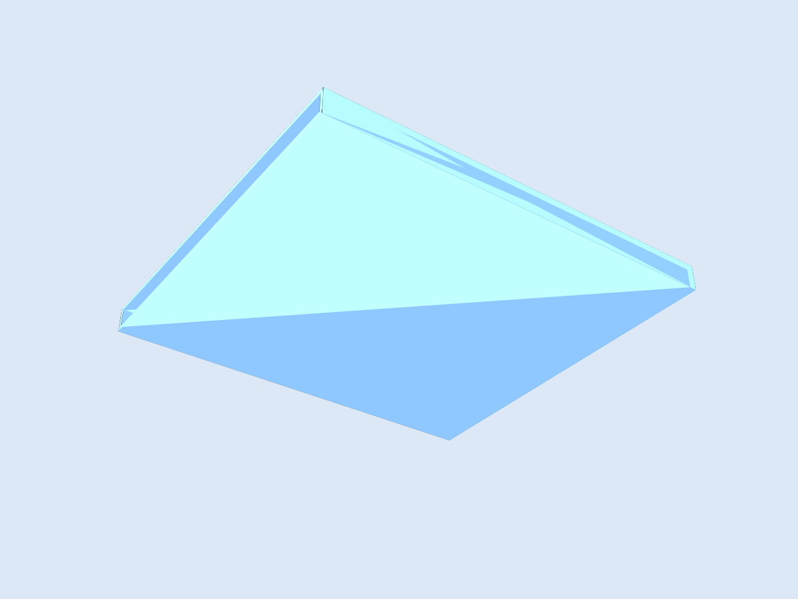
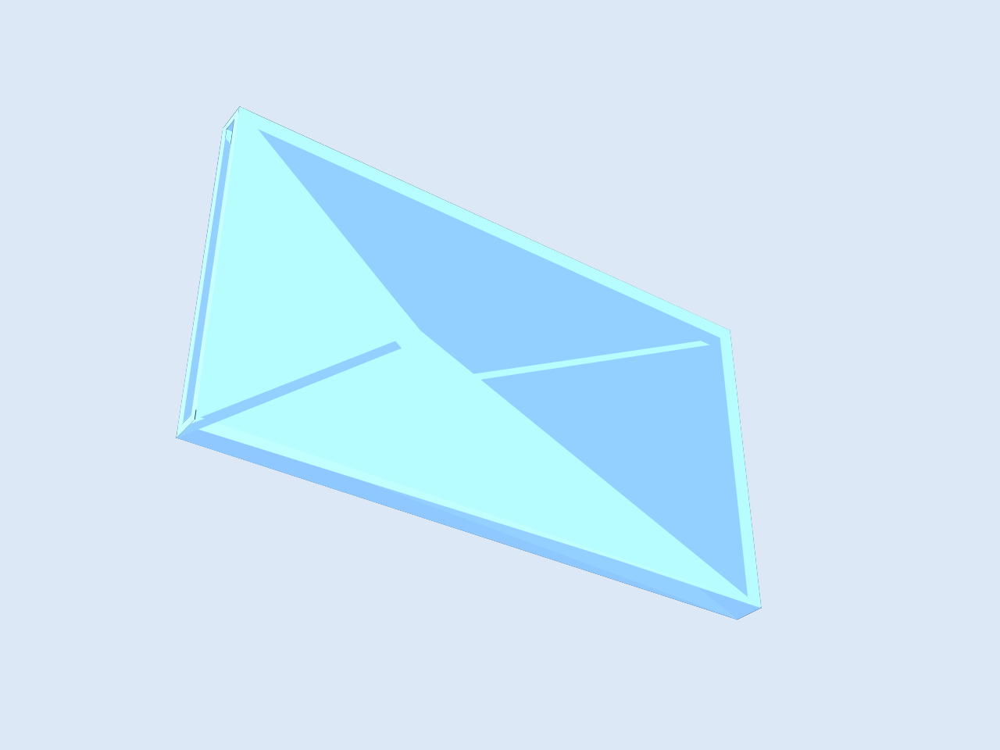
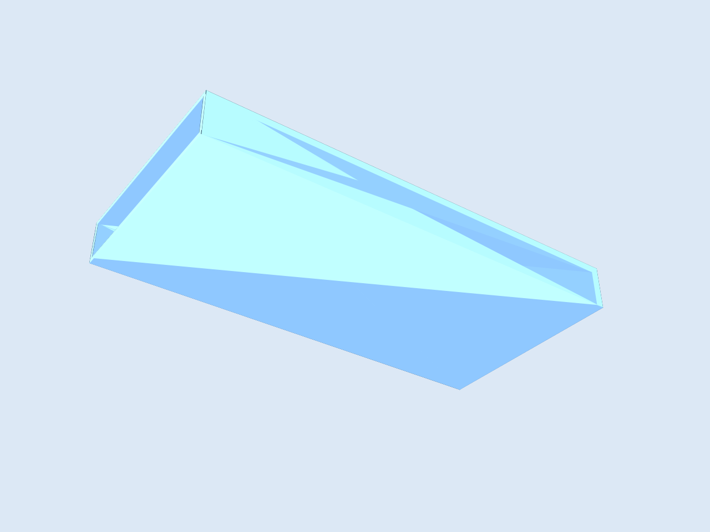
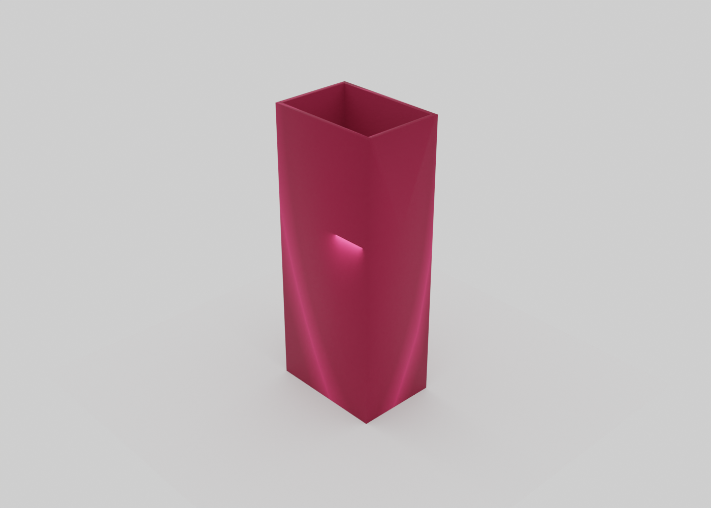
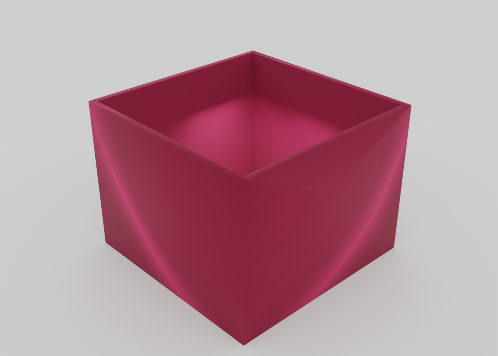
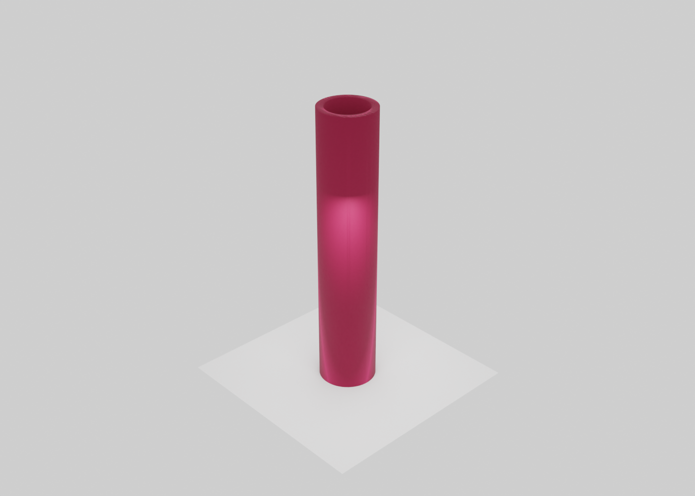
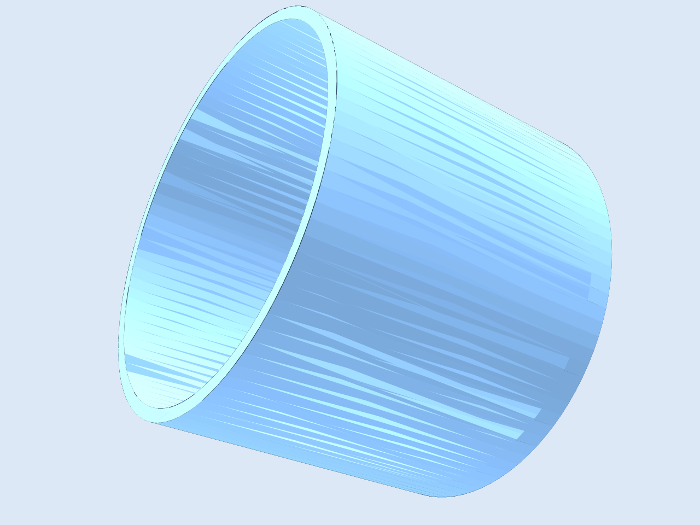
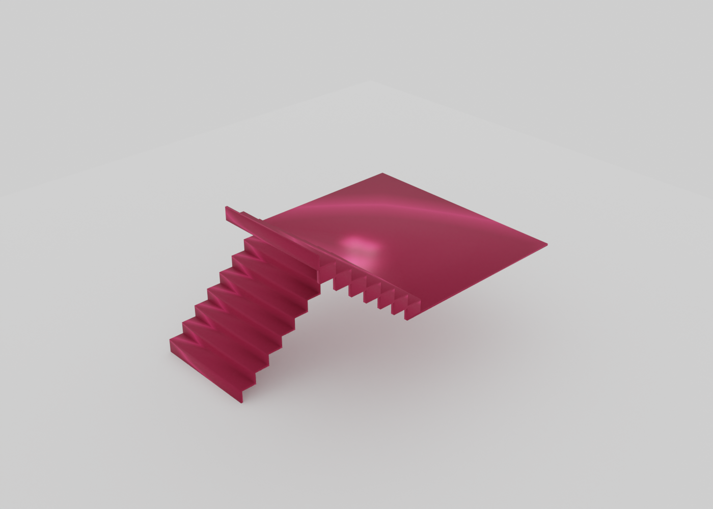

# Foamcutter Designs

## Overview

This repository contains OpenJSCAD-based design experiments and printable parts.  
Each design lives in its own folder under [`designs/`](./designs/) with source and generated artifacts.

## Design Summary

- [**Bell hammer**](./designs/bell-hammer/): replacement hammer for a Brompton bike bell with offset pocket, side bore, and stepped top.
- [**Boxmaker**](./designs/boxmaker/): set of open-top box and cylinder variants generated from measured figure dimensions.
- [**Foamcutter v2**](./designs/foamcutter-v2/): updated foam cutter support assembly plus X-Acto No. 11 outline tooling model.
- [**Staircase with landing**](./designs/starcase-with-landing/): parametric U-turn staircase model with landing and glue tabs.

## Outputs At A Glance

- Bell hammer STL/PNG:
  - [`designs/bell-hammer/bell-hammer.stl`](./designs/bell-hammer/bell-hammer.stl)
  - [`designs/bell-hammer/bell-hammer.png`](./designs/bell-hammer/bell-hammer.png)
  - 
- Boxmaker STLs:
  - [`designs/boxmaker/figure1.stl`](./designs/boxmaker/figure1.stl)
  - [`designs/boxmaker/figure2.stl`](./designs/boxmaker/figure2.stl)
  - [`designs/boxmaker/figure3.stl`](./designs/boxmaker/figure3.stl)
  - [`designs/boxmaker/figure4.stl`](./designs/boxmaker/figure4.stl)
  - [`designs/boxmaker/figure5.stl`](./designs/boxmaker/figure5.stl)
  - [`designs/boxmaker/figure6.stl`](./designs/boxmaker/figure6.stl)
  - [`designs/boxmaker/figure7.stl`](./designs/boxmaker/figure7.stl)
  - [`designs/boxmaker/figure1.png`](./designs/boxmaker/figure1.png)
  - [`designs/boxmaker/figure2.png`](./designs/boxmaker/figure2.png)
  - [`designs/boxmaker/figure3.png`](./designs/boxmaker/figure3.png)
  - [`designs/boxmaker/figure4.png`](./designs/boxmaker/figure4.png)
  - [`designs/boxmaker/figure5.png`](./designs/boxmaker/figure5.png)
  - [`designs/boxmaker/figure6.png`](./designs/boxmaker/figure6.png)
  - [`designs/boxmaker/figure7.png`](./designs/boxmaker/figure7.png)
  - 
  - 
  - 
  - 
  - 
  - 
  - 
- Foamcutter v2 STL/PNG:
  - [`designs/foamcutter-v2/foamcutter-v2.stl`](./designs/foamcutter-v2/foamcutter-v2.stl)
  - [`designs/foamcutter-v2/foamcutter-v2.png`](./designs/foamcutter-v2/foamcutter-v2.png)
  - 
  - [`designs/foamcutter-v2/xacto-no11-outline.stl`](./designs/foamcutter-v2/xacto-no11-outline.stl)
  - [`designs/foamcutter-v2/xacto-no11-outline.png`](./designs/foamcutter-v2/xacto-no11-outline.png)
  - 
- Staircase with landing STL/PNG:
  - [`designs/starcase-with-landing/staircase-with-landing.stl`](./designs/starcase-with-landing/staircase-with-landing.stl)
  - [`designs/starcase-with-landing/staircase-with-landing.png`](./designs/starcase-with-landing/staircase-with-landing.png)
  - 
