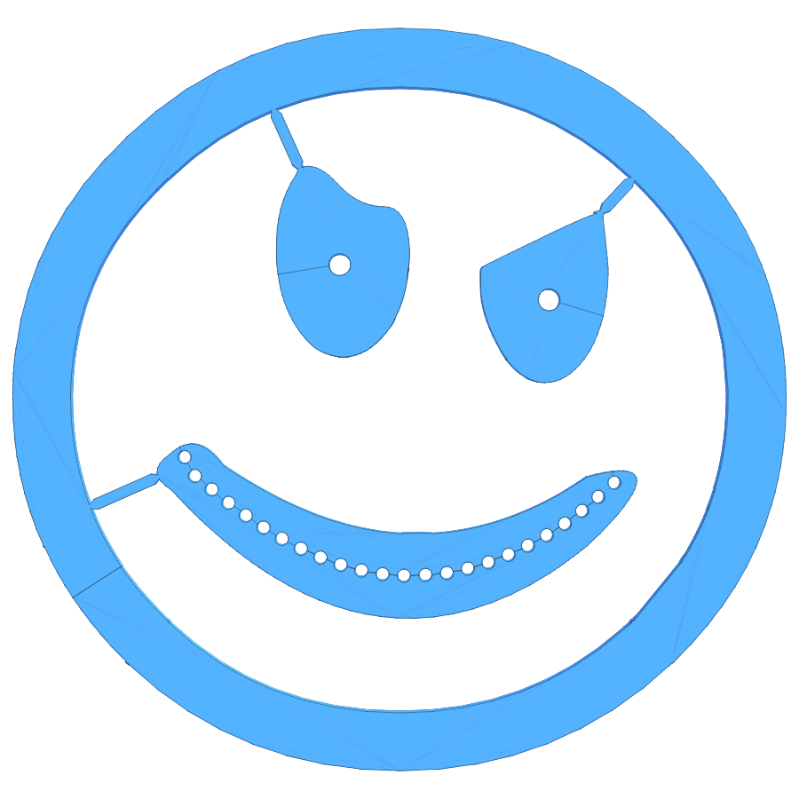
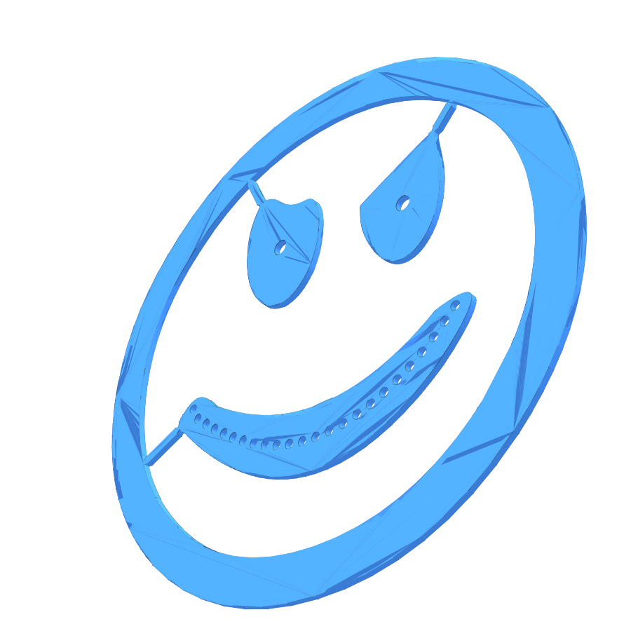

# Acid Badge

## Overview

The classic acid-house smiley — traced from the supplied
[`bad-smiley-bw.svg`](./bad-smiley-bw.svg) — with a ring of 24 evenly-
spaced 3.1mm holes following the mouth's own curve, and a 5.1mm
push-fit hole through each eye. The face ring, mouth and both eyes are
connected by 3 thin snap-off strips so the whole badge prints as
**one piece**.

### How the SVG became this shape

The SVG's single `evenodd` path has 5 subpaths: the face outline (drawn
as 2 nested circles, i.e. a ring/"stroke" rather than a filled disc),
the 2 eyes, and the mouth (an organic crescent — its distance from the
face center actually varies from about 89 to 169 SVG units around its
own outline, so it's *not* a simple arc at one fixed radius). Each was
traced by flattening the SVG's bezier curves into line segments,
centered on the face circle's own center.

### Fitting the holes to the mouth

The 24 holes follow the mouth's own local middle rather than sitting on
one constant-radius arc. For a dense set of angles from the face's own
center, a ray is cast through the mouth's traced outline; the MIDPOINT
of that ray's entry/exit crossing becomes a sample of the mouth's local
centerline. The holes are then walked along that centerline by true
chord distance (not raw arc length), so consecutive hole centers really
are 5mm apart in a straight line — matching the original brief exactly.
Each candidate placement is checked against the mouth's *actual*
nearest-boundary distance in every direction (not just along the radial
ray, which under-detects risk near the crescent's pointed tips), and
the walked window is chosen so every one of the 24 holes keeps at least
1mm of material on each side. The largest hole spacing that still
satisfies that margin everywhere pins down the whole badge's scale
(same principle as the previous constant-radius version, just measured
along a curve instead of a circle).

### Eye holes

Each eye gets one 5.1mm-diameter hole (5mm + 0.1mm tolerance, sized for
a push fit), centered on that eye's own area-weighted centroid — not
just its bounding-box center. The full hole circle is checked the same
way against the eye's true nearest-boundary distance; both eyes have
generous margin (roughly 10-12mm) since they're much bigger than a
single 5.1mm hole.

### Connecting strips (prints as one piece)

3 thin strips glue the badge together: ring-to-mouth, ring-to-eyeLeft,
ring-to-eyeRight (the mouth and eyes don't connect directly to each
other — they don't need to, since they're all reachable through the
ring). Each strip's endpoint is the closest point between the ring's
inner boundary and the satellite shape's own outline. The strip is
`2.5mm` wide through its middle, but necks down to `1mm` **exactly at
the 2 "snijpunten"** — the points where it actually crosses each
shape's traced boundary — so snapping it off by hand leaves almost no
nub on either piece. Past each snijpunt the strip widens back out for
a short stretch (`1.2mm`) into the shape's own solid material, purely
so the geometry has real overlapping area to fuse against there (a
strip that only touches a boundary at a single point doesn't merge
into one solid — see "Real bugs found building this" below).

### Earlier versions

The very first pass at "acid badge" (before the SVG was supplied) was
just a plain ring of 24 x 3mm holes with no other shape. The next pass
(after the SVG) sat the 24 mouth holes on one constant-radius arc from
the face center. The pass after that moved the holes onto the mouth's
own centerline but still shipped as 4 disjoint solids with 3mm mouth
holes and a 3mm extrusion. All are superseded by this one; see git
history if any of them is ever needed again.

## Geometry

- Mouth holes: `24`, each `3.1 mm` diameter, `5 mm` apart
  center-to-center (true chord distance, walked along the mouth's own
  local centerline), at least `1 mm` of material kept on every side of
  every hole
- Eye holes: `1` per eye, `5.1 mm` diameter (`5 mm` + `0.1 mm` push-fit
  tolerance), centered on each eye's area-weighted centroid
- Connecting strips: `3`, `2.5 mm` wide, necked to `1 mm` at each
  "snijpunt" (see above)
- Extrusion height: `2 mm`
- Overall face diameter: `≈180 mm` (derived from the hole spec + the
  SVG's own proportions, not an independently chosen size)

## Source

- Original artwork: [`bad-smiley-bw.svg`](./bad-smiley-bw.svg)
- JSCAD: [`acid-badge.jscad`](./acid-badge.jscad)
- OpenJSCAD: [Open `acid-badge.jscad`](https://openjscad.xyz/v3/#https://raw.githubusercontent.com/sponnet/ai-3d-designs/refs/heads/main/designs/acid-badge/acid-badge.jscad)

## Outputs

- STL: [`acid-badge.stl`](./acid-badge.stl)
- PNG preview (top): [`acid-badge-top.png`](./acid-badge-top.png)
- PNG preview (isometric): [`acid-badge-iso.png`](./acid-badge-iso.png)

## Preview

## Real bugs found building this

Two separate, serious bugs in `@jscad/modeling`'s 2D booleans, both
specific to combining *non-convex* traced/organic polygons:

1. **`union()`/`subtract()` between 2 concave polygons whose bounding
   boxes overlap silently drops one operand entirely** — returns just
   the *other* shape, no error. Confirmed it's not about self-
   intersections, duplicate points, or vertex count (all clean here);
   reproduces even with small hand-written concave polygons placed
   inside each other's bbox, and disappears once both shapes are
   convex. `union(a, b, c, d)` with 4+ arguments also came back
   completely empty in one case even though every argument measured
   fine alone and pairwise unions of any 2-3 worked.
2. Triangulating each shape (via `@jscad/modeling`'s own internal
   earcut, so every piece fed into `union()` is convex) fixed bug 1,
   but then accumulating ~130+ sequential `union()` calls per shape
   introduced enough floating-point drift that `extrudeLinear` failed
   with `geometry is not closed at vertex ...` — genuine, sometimes
   large (10+ unit) gaps, not just numerical noise.

Given jscad's own booleans couldn't reliably combine these shapes
either way, the actual fix bypasses them for this: an offline script
uses the (separately installed, well-tested) `polygon-clipping` npm
package to compute the real unions/differences, then merges each
result's holes into its exterior with a "keyhole" bridge (a thin slit
connecting a hole's boundary to the exterior, turning a polygon-with-
holes into one simple loop) — producing a point loop that needs *no*
jscad boolean operations at all, just `polygon()` + `extrudeLinear()`.

A third, subtler issue turned up while re-placing the mouth holes along
its centerline instead of a fixed-radius arc: the first pass measured
"is there enough material here for a hole" only along the *radial* ray
from the face center (the same direction used to place the hole). That
silently passed 2 of the 24 candidate holes right at the tips of the
crescent, where the boundary curves back on itself and isn't
perpendicular to the radial ray at all — their full circles actually
poked outside the mouth outline in a direction the radial check never
looked at, and `polygon-clipping`'s `difference()` correctly merged
them into the exterior boundary instead of leaving them as separate
holes (silently returning 22 holes instead of 24, no error). The fix:
check each candidate hole's true nearest-boundary distance by casting
rays in *every* direction from its center, not just the one it was
placed along.

A fourth issue turned up gluing the 4 pieces into one with connecting
strips: a strip whose endpoint sits exactly *on* a shape's boundary
curve doesn't reliably fuse with `polygon-clipping`'s `union()` — a
strip only overlapping a boundary at a single touching point stays a
separate polygon in the result instead of merging into one (the
perpendicular at that point isn't guaranteed to line up with the local
boundary tangent, so the touching "contact" can be a sliver with ~0
actual area). Fix: extend each strip `1.2mm` *past* the boundary, into
the shape's own solid interior, before widening back out — guaranteeing
real overlapping area for `union()` to fuse against, while keeping the
strip's narrowest point (1mm) exactly at the boundary crossing itself,
which is what actually matters for a clean, low-nub snap-off.
