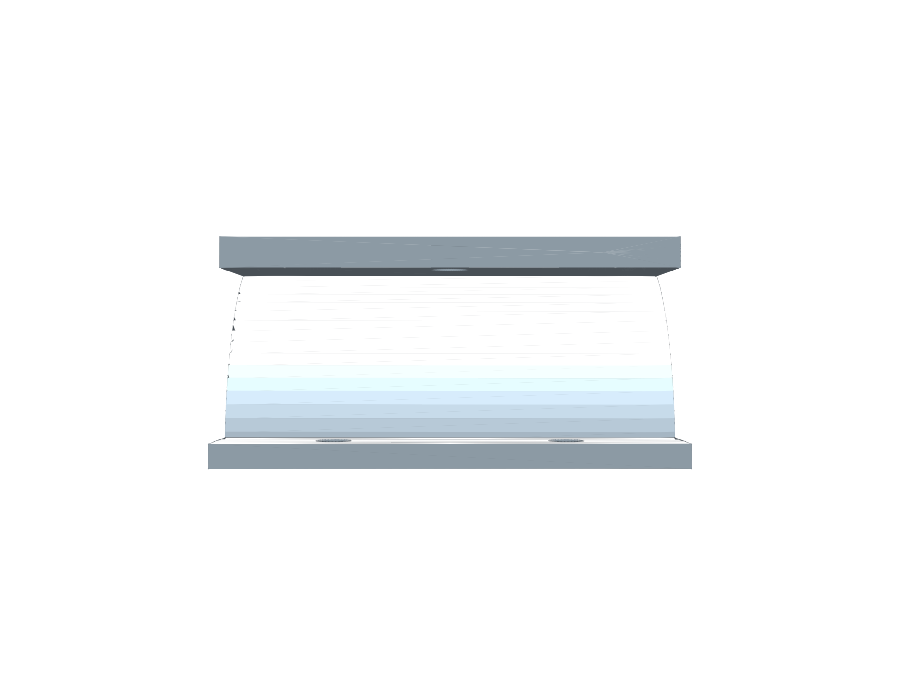
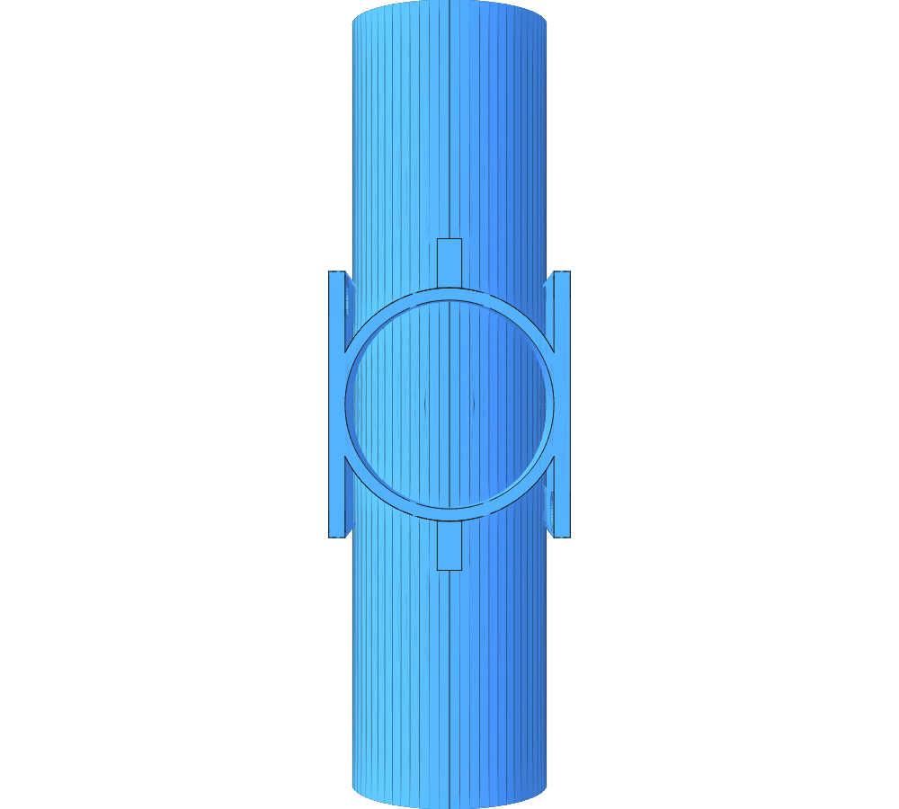

# Adapter — BnD 20Vmax mount to Ø51mm tube

## Overview

Adapter that lets a "BnD 20Vmax mount v6 (2017)" tool holder clamp onto a
Ø51mm tube instead of a wall. One printed piece has a flat plate matching
the mount's own back-plate hole pattern, lying flat lengthwise along the
tube (tangent at the top of the shell, sunk into the shell wall for a
solid bond), and a 180° half-shell that cradles half the tube. **Two** of
these pieces (the 2nd installed rotated 180° around the tube) sandwich
the tube; each piece has a flange with 2 holes at **both** ends of its
half-shell, so the 2 pieces bolt together at both sides of the tube (4
bolts total for the full clamp) — a standard 2-piece pipe-clamp
arrangement.

Assembled, the 2 mounting plates end up directly opposite each other
(180° apart around the tube), so this doubles as a way to mount 2 BnD
tool holders on opposite sides of the same pole/tube.

## Source measurement

The mounting hole pattern was measured directly from the uploaded
[`BnD_20Vmax_mount_v6_2017.stl`](./BnD_20Vmax_mount_v6_2017.stl): its flat
back face (normal along the file's Y axis, at `y=3`) is exactly
**60 × 65 mm**, with 3 holes (fit by least-squares circle to the hole-edge
vertices):

| Hole | Local X (from left) | Local Z (from bottom) | Measured Ø |
|------|---------------------|------------------------|------------|
| Top-left | 6.06 mm | 59.66 mm | 9.28 mm |
| Top-right | 53.86 mm | 59.66 mm | 9.35 mm |
| Bottom-center | 30.13 mm | 3.84 mm | 4.83 mm |

The adapter symmetrizes these slightly (6.0/54.0 mm) and rounds the
diameters up a touch for easy clearance (9.5 mm / 5.0 mm) — see
`PLATE_HOLES` in the source.

## Geometry / assumptions

Since several dimensions weren't specified, these are the assumptions
baked into the parametric source (`adapter.jscad`) — all named constants,
easy to change:

- **Plate**: `60 × 65 mm`, `4 mm` thick, holes as above (through-holes,
  no threads — use your own bolts/nuts or the BnD mount's own screws).
  Lies flat, its `60 mm` side along the tube axis (matching the shell
  length) and its `65 mm` side running along the tube's tangent/top
  direction, centered over the shell.
- **Plate-to-shell bond**: a flat plate can only truly touch a round tube
  along one line, so the plate's underside is sunk down to the shell's
  *inner* radius — at the centerline it shares the full `3 mm` wall
  thickness (plus its own `4 mm`) with the shell, unioned into one solid
  piece, instead of meeting it at a knife-edge tangent line. Toward the
  plate's outer edges the shell curves away underneath it (a normal,
  expected overhang for a flat bracket on a round tube — the same as most
  pipe-mount plates).
- **Tube clamp shell**: inner radius `25.5 mm` (Ø51mm tube), wall
  `3 mm` (assumed — not specified), length `60 mm` (matches the plate
  width).
- **End flanges**: `12 mm` radial width beyond the shell (assumed), each
  piece contributes `3 mm` thickness (mates with the other piece's `3 mm`
  to form `6 mm` combined at each bolted joint — assumed), 2 holes per
  flange, Ø`4.5 mm` (M4 clearance, assumed), spaced 30mm apart.

**If any of the assumed dimensions (wall thickness, flange size, bolt
size) don't match what you need, they're single constants at the top of
`adapter.jscad` — easy to adjust and re-export.**

## Source

- Reference STL (as uploaded): [`BnD_20Vmax_mount_v6_2017.stl`](./BnD_20Vmax_mount_v6_2017.stl)
- JSCAD: [`adapter.jscad`](./adapter.jscad)
- OpenJSCAD: [Open `adapter.jscad`](https://openjscad.xyz/?uri=https://raw.githubusercontent.com/sponnet/ai-3d-designs/refs/heads/main/designs/adapter-BnD-mount/adapter.jscad#)

## Outputs

- STL (single piece — print 2 of these): [`adapter.stl`](./adapter.stl)
- PNG preview (isometric): [`adapter-iso.png`](./adapter-iso.png)
- PNG preview (front, showing the plate + hole pattern): [`adapter-front.png`](./adapter-front.png)
- PNG preview (2 pieces assembled around a Ø51mm reference tube, isometric): [`assembly-iso.png`](./assembly-iso.png)
- PNG preview (assembly, viewed down the tube axis): [`assembly-end.png`](./assembly-end.png)

## Preview

Single piece:

Two pieces assembled around a Ø51mm tube:

