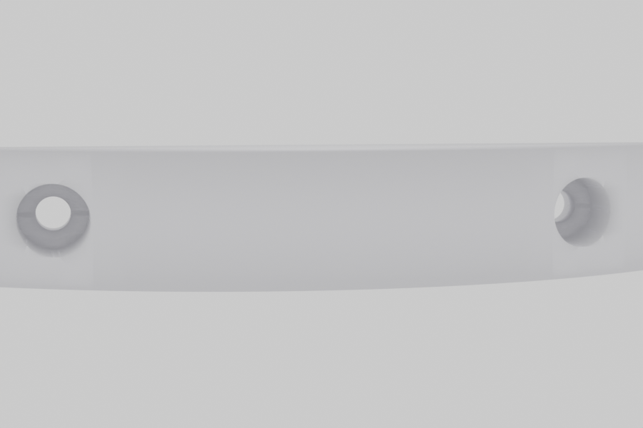

# beugel

Circular-segment bracket — a flat cylinder with one chord face, extruded 15 mm.

| Parameter | Value |
|-----------|-------|
| Chord width (flat face) | 100 mm |
| Thickness | 15 mm |
| Hole entry (Ø, at flat face) | 4 mm |
| Hole body (Ø) | 8 mm |
| Lip depth | 5 mm |
| Hole inset from edge | 20 mm |

## Open in OpenJSCAD

[Open beugel.jscad in OpenJSCAD online editor](https://openjscad.xyz/#https://raw.githubusercontent.com/sponnet/ai-3d-designs/main/designs/beugel/beugel.jscad)

## Preview

