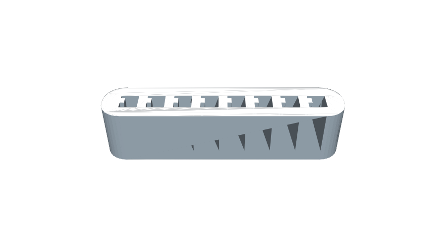

# Dupont Connector Clamp

## Overview

A clamp block that holds a row of single-pin Dupont/KK-2.54 style female
connector housings side by side, so a bundle of jumper-wire connectors
stays aligned and doesn't slide apart. Based on the sketch showing a
rounded outer body with a row of keyed pockets.

## Geometry (see `dupont-connector-clamp.jscad`)

- **Connector count:** `CONNECTOR_COUNT`, default **8**. Also exposed as
  the `connectorCount` parameter for the openjscad.xyz UI / CLI (`--connectorCount`).
- **Pocket size:** `SLOT_WIDTH × SLOT_HEIGHT` (default `2.6 × 2.8 mm`) —
  one through-pocket per connector, cut all the way through the block.
  Measure your own connector housings and adjust if the fit is too
  tight/loose.
- **Divider:** `DIVIDER_THICKNESS` (default `1.2 mm`) wall between
  neighbouring pockets.
- **Outer walls:** `OUTER_SIDE_WALL` / `OUTER_TOP_BOTTOM_WALL` around the
  row of pockets; outer corners rounded by `CORNER_RADIUS`.
- **Clamp depth:** `BODY_THICKNESS` (default `8 mm`), how far the block
  grips along the connector housings (the extrusion direction).
- **Polarizing key:** each pocket has a small tab left in its left wall
  (`KEY_TAB_DEPTH × KEY_TAB_HEIGHT`, near the top) matching the stepped
  key slot in the reference picture, so a connector only fits one way
  round. Set `KEY_TAB_ENABLED = false` to fall back to plain rectangular
  pockets.
- Overall width/height are derived from the above so the outer body
  always fits exactly `CONNECTOR_COUNT` pockets.

## Source

- JSCAD: [`dupont-connector-clamp.jscad`](./dupont-connector-clamp.jscad)
- OpenJSCAD: [Open `dupont-connector-clamp.jscad`](https://openjscad.xyz/?uri=https://raw.githubusercontent.com/sponnet/ai-3d-designs/refs/heads/main/designs/dupont-connector-clamp/dupont-connector-clamp.jscad#)

## Export

From the repository root:

```bash
npm run dupont-connector-clamp:stl
npm run dupont-connector-clamp:png   # requires Blender (BLENDER_BIN)
```

## Outputs

- STL: [`dupont-connector-clamp.stl`](./dupont-connector-clamp.stl)
- PNG preview: [`dupont-connector-clamp.png`](./dupont-connector-clamp.png)
  (quick `@scalenc/stl-to-png` render generated in this environment since
  Blender wasn't available; regenerate with
  `npm run dupont-connector-clamp:png` for the standard Blender-styled
  preview used by the other designs).

## Preview


