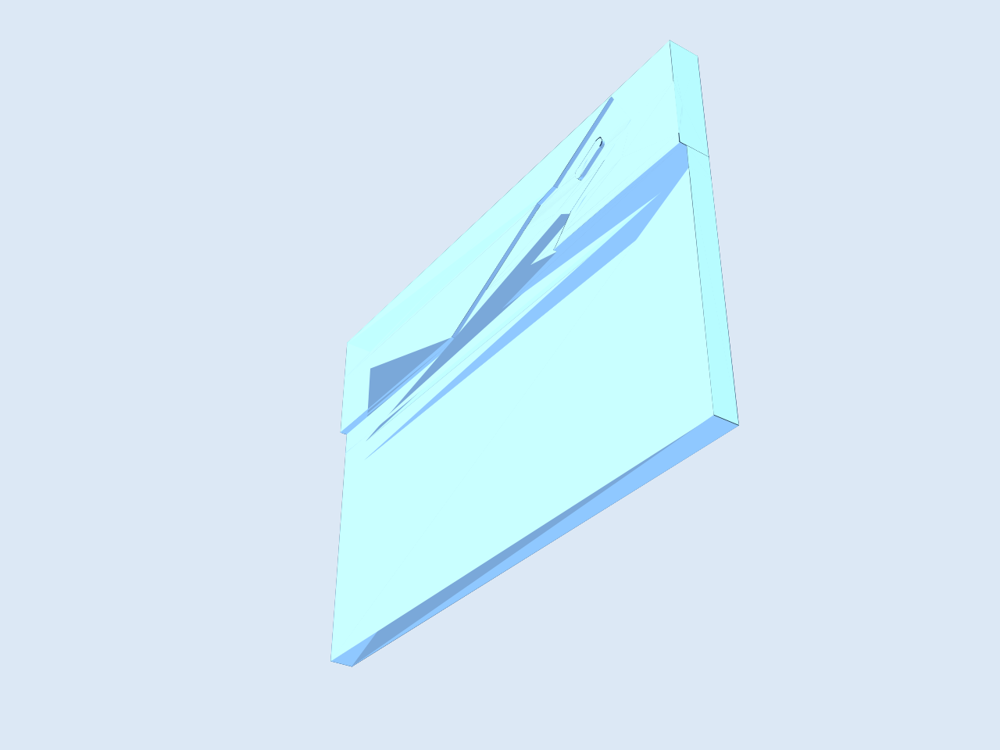
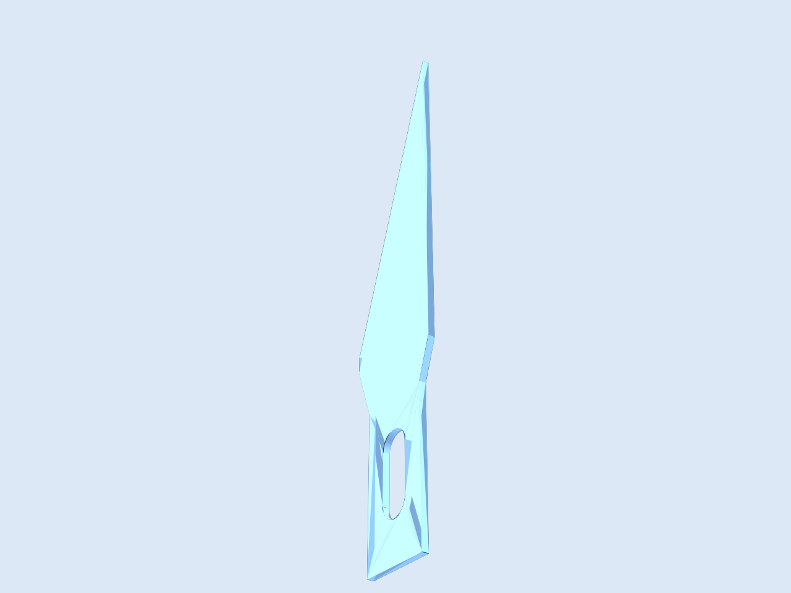

# Foamcutter V2

## Overview

Second iteration of the foam cutter fixture, including an X-Acto No. 11 profile and a mounting/support block assembly.

## Geometry

- Main fixture combines:
  - Base support block
  - Secondary support edge
  - Top block with blade-slot subtraction and mount holes
- Includes separate outline design for the X-Acto No. 11 blade profile.

## Source

- Fixture JSCAD: [`foamcutter-v2.jscad`](./foamcutter-v2.jscad)
- Blade outline JSCAD: [`xacto-no11-outline.jscad`](./xacto-no11-outline.jscad)

## Outputs

- STL files:
  - [`foamcutter-v2.stl`](./foamcutter-v2.stl)
  - [`xacto-no11-outline.stl`](./xacto-no11-outline.stl)
- PNG previews:
  - [`foamcutter-v2.png`](./foamcutter-v2.png)
  - [`xacto-no11-outline.png`](./xacto-no11-outline.png)

## Previews

