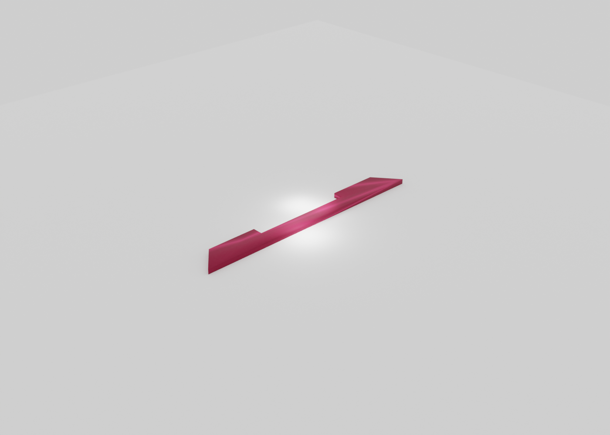

# Mounting Hook

## Overview

Hook-like mounting profile based on the provided hand sketch, modeled as a 2D polygon and extruded to 20 mm.

## Geometry

- Extrusion height: `20 mm`
- Overall profile length: `48 mm`
- Mid-span reference length: `30 mm`
- Main body width: `5 mm`
- Two opposite lugs near the center to match the sketch language

## Source

- JSCAD: [`mounting-hook.jscad`](./mounting-hook.jscad)
- OpenJSCAD: [Open `mounting-hook.jscad`](https://openjscad.xyz/?uri=https://raw.githubusercontent.com/sponnet/ai-3d-designs/refs/heads/main/designs/mounting-hook/mounting-hook.jscad#)

## Outputs

- STL: [`mounting-hook.stl`](./mounting-hook.stl)
- PNG preview: [`mounting-hook.png`](./mounting-hook.png)

## Preview

