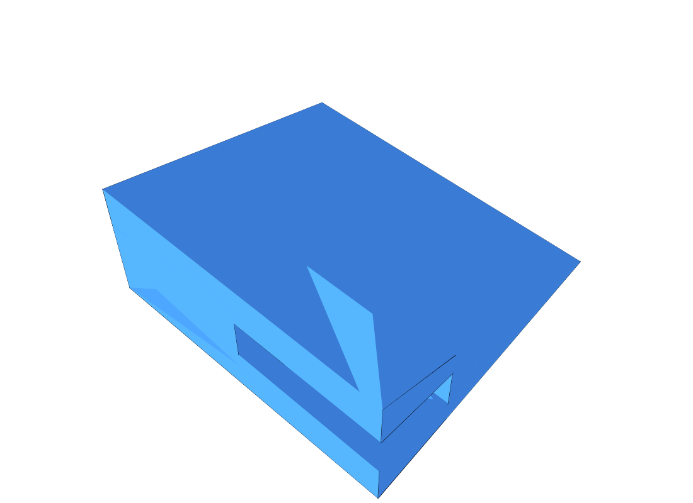

# Partition

## Overview

A long, thin, standing triangular partition — an isoceles triangle in
cross-section, base at the bottom, apex at the top — with a short slot cut
into its base at each end, sized to push-fit over a ridge from
[`designs/totemik/ring.jscad`](../totemik/ring.jscad) (`RIDGE_WIDTH` x
`RIDGE_PROTRUSION`). The middle of the length stays solid; only the last
`SLOT_END_LENGTH` at each end is slotted.

## Geometry

- Overall length: `150 mm`
- Triangle height (apex above the base): `10 mm`
- Triangle base width: `5 mm`
- Slot: `6 mm` long (`SLOT_END_LENGTH`) at each end of the part, nominally
  `1.5 mm` wide / `3 mm` deep — matching the ring's `RIDGE_WIDTH` /
  `RIDGE_PROTRUSION`
- Push-fit tolerance: `0.15 mm` (`TOLERANCE`, not specified in the brief —
  assumed) added to both the slot width and depth, so the actual cut is
  `1.65 mm` wide x `3.15 mm` deep — sized a touch larger than the ridge so
  typical FDM printing error (holes print undersize, pegs print oversize)
  still leaves a snug push-on fit rather than one that's impossible to
  assemble or too loose to grip

## Source

- JSCAD: [`partition.jscad`](./partition.jscad)
- OpenJSCAD: [Open `partition.jscad`](https://openjscad.xyz/?uri=https://raw.githubusercontent.com/sponnet/ai-3d-designs/refs/heads/main/designs/partition/partition.jscad#)

## Outputs

- STL: [`partition.stl`](./partition.stl)
- PNG preview (full length): [`partition-iso.png`](./partition-iso.png)
- PNG preview (one end, from underneath, showing the end-slot):
  [`partition-detail.png`](./partition-detail.png)

## Preview

Full length (150 mm — the 1.5 mm slot isn't visible at this scale):

Close-up of one end (slot open at the tip, stopping after 6 mm):

