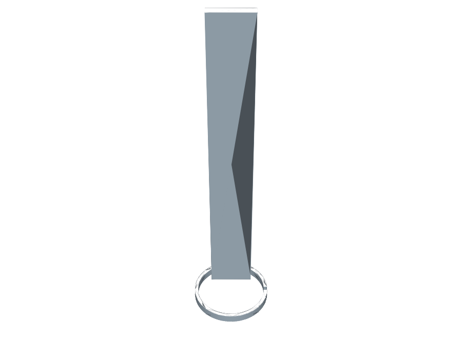

# Totemik Guts

## Overview

Open ring (split-ring) profile with a long beam standing through it in the
Z direction, touching the ring's inner wall at exactly 2 points.

## Geometry

### Ring

- Outer diameter: `49 mm`
- Wall thickness (radial): `2 mm` (inner diameter `45 mm`)
- Notch/opening at 0°: `3 mm` wide, cut fully through the wall
- Extrusion height: `5 mm`

### Beam

- Base footprint: `27 mm x 5 mm`
- Extrusion height (Z): `200 mm`, base at `z = 0` — same base plane as the
  ring, so the ring sits at the bottom of the beam
- Positioned so its `27 mm` edge forms a chord of the inner circle
  (radius `22.5 mm`) at `18 mm` from the ring center — the 2 endpoints of
  that edge land exactly on the inner wall (`13.5-18-22.5` is a `3-4-5`
  triangle scaled by `4.5`), giving exactly 2 touch points. The beam then
  extends `5 mm` further inward, staying clear of the wall everywhere else.
  Placed opposite the 0° notch (along +Y) so the two features don't clash.

## Source

- JSCAD: [`totemik-guts.jscad`](./totemik-guts.jscad)
- OpenJSCAD: [Open `totemik-guts.jscad`](https://openjscad.xyz/?uri=https://raw.githubusercontent.com/sponnet/ai-3d-designs/refs/heads/main/designs/totemik-guts/totemik-guts.jscad#)

## Outputs

- STL: [`totemik-guts.stl`](./totemik-guts.stl)
- PNG preview: [`totemik-guts.png`](./totemik-guts.png)

## Preview

