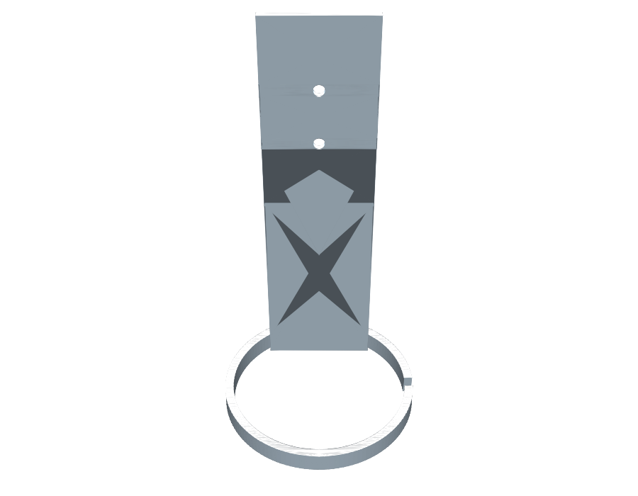

# Totemik Guts

## Overview

Open ring (split-ring) profile with a short beam standing on it in the Z
direction. The beam is pushed sideways so 2 corners of its long edge sit
inside the ring wall, giving real solid overlap (not just a tangent touch)
for a reliably connected 3D print. The beam's top half is thinned down and
carries 2 through-holes.

## Geometry

### Ring

- Outer diameter: `49 mm`
- Wall thickness (radial): `2 mm` (inner diameter `45 mm`)
- Notch/opening at 0°: `3 mm` wide, cut fully through the wall
- Extrusion height: `5 mm`

### Beam

- Base footprint: `27 mm x 2.5 mm`, extrusion height (Z) `100 mm`, base at
  `z = 0` — same base plane as the ring, so the ring sits at the bottom of
  the beam
- Positioned so its `27 mm` edge forms a chord at `~19.24 mm` from the ring
  center — the 2 endpoints of that edge land on the middle of the ring
  wall (radius `23.5 mm`, halfway between inner `22.5 mm` and outer
  `24.5 mm`), so those 2 corners are embedded in solid ring material
  instead of just touching the inner surface. Placed opposite the 0°
  notch (along +Y) so the two features don't clash.
- Bottom half (`z = 0` to `50 mm`, against the ring): full `2.5 mm` depth,
  keeping the overlap with the ring wall.
- Top half (`z = 50` to `100 mm`, away from the ring): depth halved to
  `1.25 mm`.
- 2 through-holes in that thinned top half, `3 mm` diameter, axis along Y
  (perpendicular to the ring's Z axis), stacked one above the other along
  Z, `±7 mm` either side of the top half's mid-height (`z = 75 mm`).
- Ring and beam are unioned, then the 2 holes subtracted, into a single
  printable solid.

### `beamNotchSide` parameter — printing 2 interlocking halves

The top half's depth reduction can be trimmed from either side:

- `inner` (default): removes material toward the ring center, keeping the
  outer (wall-facing) edge fixed.
- `outer`: removes material toward the ring wall instead, keeping the
  inner (center-facing) edge fixed — the mirror image of `inner`.

Printing one piece with each setting gives 2 halves whose thinned top
sections face opposite directions, so they nest into a full-depth lap
joint when assembled. The parameter is exposed via
`getParameterDefinitions()`, so it shows up as a choice field in the
openjscad.xyz UI, and can be set from the CLI with
`--beamNotchSide inner` / `--beamNotchSide outer`.

## Source

- JSCAD: [`totemik-guts.jscad`](./totemik-guts.jscad)
- OpenJSCAD: [Open `totemik-guts.jscad`](https://openjscad.xyz/?uri=https://raw.githubusercontent.com/sponnet/ai-3d-designs/refs/heads/main/designs/totemik-guts/totemik-guts.jscad#)

## Outputs

- STL (`beamNotchSide: inner`, default): [`totemik-guts.stl`](./totemik-guts.stl)
- PNG preview: [`totemik-guts.png`](./totemik-guts.png)
- STL (`beamNotchSide: outer`): [`totemik-guts-outer.stl`](./totemik-guts-outer.stl)
- PNG preview: [`totemik-guts-outer.png`](./totemik-guts-outer.png)

## Preview

