# Totemik

Nine related explorations for the Totemik project:

- **Ring** and **Partition**: a ring band with a push-fit partition strip
  (see below).
- **Totemik Guts**: a separate, independent exploration of a ring + beam
  design (different dimensions from the Ring above — not interchangeable
  with it).
- **Totemik Guts Coupler**: a straight extension piece that joins 2
  Totemik Guts beams end to end (same beam cross-section).
- **Bottom Plug**: a push-fit foot for the bottom of a 49mm-ID tube,
  unrelated in dimensions to the other explorations.
- **Keypad**: a minimalist 4-key Cherry MX switch bar with mounting tabs,
  also unrelated in dimensions to the other explorations.
- **Gear Ring**: a toothed ring with a raised collar, also unrelated in
  dimensions to the other explorations.
- **Mic Holder**: an open-bottom tray for a microphone, also unrelated in
  dimensions to the other explorations.
- **Bottom Support**: a hollow cylinder with a through-hole, thicker end
  rings and a thin 2mm-wall middle section, also unrelated in dimensions
  to the other explorations.

## Ring

### Overview

Circular ring band modeled from a hand sketch: a plain band with a small
notch cut at the top and two bar-shaped blocks sitting on the outer surface,
one on each side of the notch. Each block carries a small retaining lip that
always hangs off its outer end ("tip", the end farthest from the ring) — the
lip tracks that end dynamically as `LIP_DEPTH` or `BLOCK_DEPTH` change —
meant to catch a cord tied around the two blocks (to pinch the notch shut)
so it can't slide off.

### Geometry

- Inner diameter: `51 mm`
- Wall thickness: `1 mm` (outer diameter `53 mm`) — also drives block
  thickness and the lip's sideways overhang, see below
- Extrusion height (band height): `10 mm` — also drives the lip's own height
- Top notch: `5 mm` wide, cut fully through the wall
- Blocks: thickness always equals the wall thickness, `10 mm` tall
  (independent `BLOCK_HEIGHT`, from the band's bottom), one flush against
  each notch edge
- Block protrusion beyond the outer surface: `4 mm` (not given in the
  sketch/spec — assumed; adjust `BLOCK_DEPTH` if a different depth is
  wanted)
- Retaining lip: always flush with the block's outer end (moves with
  `BLOCK_DEPTH`), reaching `1 mm` inward from that end (independent
  `LIP_DEPTH`, not given in the sketch/spec — assumed), `10 mm` tall (=
  extrusion height, regardless of `BLOCK_HEIGHT`) and sticking out `1 mm`
  sideways (= wall thickness) beyond the block's outward-facing side, flush
  with the block on the notch-facing side

`BLOCK_HEIGHT` is independent of `BAND_HEIGHT` and of the lip's own height: a
block shorter than the band sits flush with the band's bottom; taller rises
above the band's top surface. The lip's height always matches the band
regardless.

- Ridges: `8` ridges (`RIDGE_COUNT`), evenly spaced around the full circle,
  each `1.5 mm` wide (`RIDGE_WIDTH`), `3 mm` protrusion beyond the outer
  surface (`RIDGE_PROTRUSION`), full band height. The pattern is offset by
  half the angular spacing from the notch (at 90°), so the notch always
  falls exactly centered between two ridges — never on top of one — however
  `RIDGE_COUNT` is set.

The blocks, lips, and ridges are all built as lobes added to the outer
cylinder before the inner hole is cut, so they fuse cleanly into the wall
and the 51 mm bore stays true (not obstructed) under any of them.

### Source

- JSCAD: [`ring.jscad`](./ring.jscad)
- OpenJSCAD: [Open `ring.jscad`](https://openjscad.xyz/?uri=https://raw.githubusercontent.com/sponnet/ai-3d-designs/refs/heads/main/designs/totemik/ring.jscad#)

### Outputs

- STL: [`ring.stl`](./ring.stl)
- PNG preview (top view, matches sketch orientation): [`ring.png`](./ring.png)
- PNG preview (isometric): [`ring-iso.png`](./ring-iso.png)

### Preview

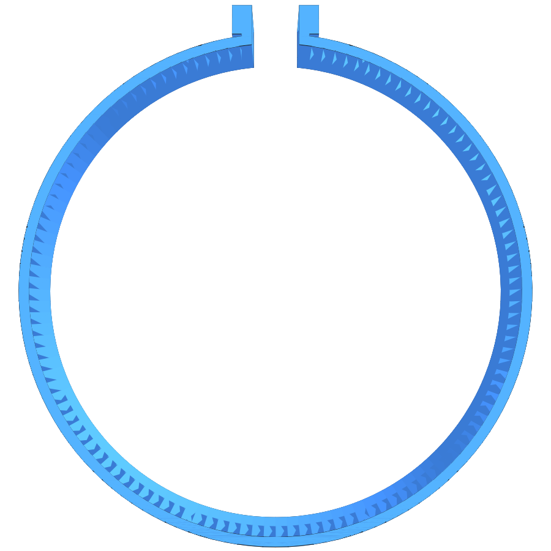
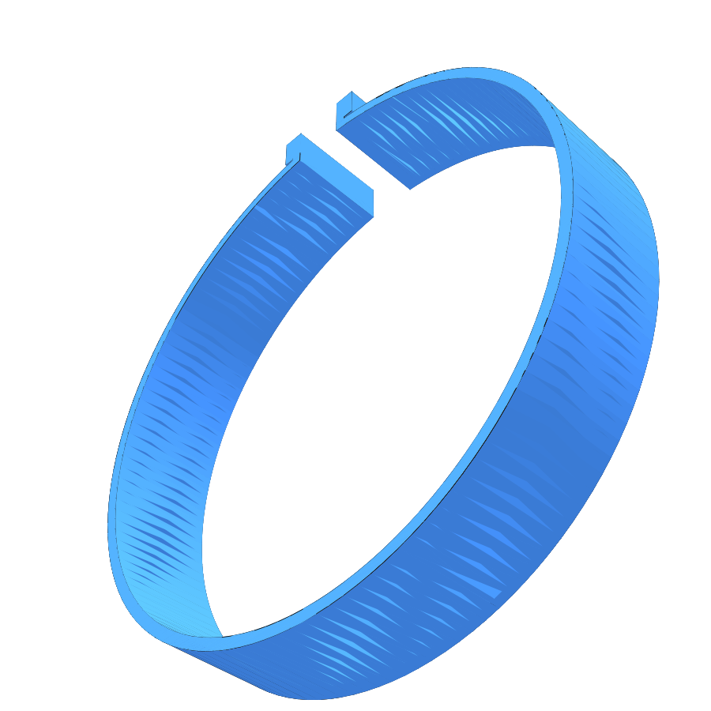

## Partition

### Overview

A long, thin, standing trapezoidal partition — an isoceles trapezoid in
cross-section, wide base at the bottom, flat blunt top — with a short slot
cut into its base at each end, sized to push-fit over a ridge from
[`ring.jscad`](./ring.jscad) (`RIDGE_WIDTH` x `RIDGE_PROTRUSION`). The
middle of the length stays solid; only the last `SLOT_END_LENGTH` at each
end is slotted.

### Geometry

- Overall length: `150 mm`
- Trapezoid height (top above the base): `10 mm`
- Trapezoid base width: `5 mm`
- Flat top width: `2 mm` (`TOP_WIDTH`) — the top is cut blunt/flat first,
  and the notches (below) are cut into that flat top afterward
- Slot: `6 mm` long (`SLOT_END_LENGTH`) at each end of the part, nominally
  `1.5 mm` wide / `3 mm` deep — matching the ring's `RIDGE_WIDTH` /
  `RIDGE_PROTRUSION`
- Push-fit tolerance: `0.15 mm` (`TOLERANCE`, not specified in the brief —
  assumed) added to both the slot width and depth, so the actual cut is
  `1.65 mm` wide x `3.15 mm` deep — sized a touch larger than the ridge so
  typical FDM printing error (holes print undersize, pegs print oversize)
  still leaves a snug push-on fit rather than one that's impossible to
  assemble or too loose to grip
- Top: scalloped along its full length with `1 mm` wide (`NOTCH_WIDTH`)
  rectangular notches, crosswise to the ridge, spaced `2 mm` apart
  (`NOTCH_SPACING`). Each notch is `1 mm` deep (`NOTCH_DEPTH`, not specified
  in the brief — assumed) — a plain straight-walled cut, so depth can be set
  to anything independent of width

### Source

- JSCAD: [`partition.jscad`](./partition.jscad)
- OpenJSCAD: [Open `partition.jscad`](https://openjscad.xyz/?uri=https://raw.githubusercontent.com/sponnet/ai-3d-designs/refs/heads/main/designs/totemik/partition.jscad#)

### Outputs

- STL: [`partition.stl`](./partition.stl)
- PNG preview (full length): [`partition-iso.png`](./partition-iso.png)
- PNG preview (one end, from underneath, showing the end-slot):
  [`partition-detail.png`](./partition-detail.png)
- PNG preview (middle section, showing the top notches):
  [`partition-top-detail.png`](./partition-top-detail.png)

### Preview

Full length (150 mm — the 1.5 mm slot and 1 mm notches aren't visible at
this scale):

Close-up of one end (slot open at the tip, stopping after 6 mm):

Close-up of the top (rectangular notches, one every 2 mm):

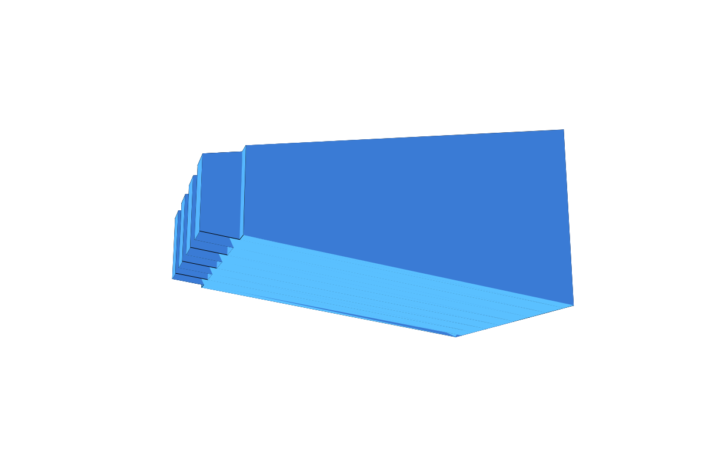

## Totemik Guts

### Overview

Open ring (split-ring) profile with a short beam standing on it in the Z
direction. The beam is pushed sideways so 2 corners of its long edge sit
inside the ring wall, giving real solid overlap (not just a tangent touch)
for a reliably connected 3D print. The beam's top half is thinned down and
carries 2 through-holes. This is a separate exploration from the Ring
above — different dimensions, not interchangeable.

### Geometry

#### Ring

- Outer diameter: `49 mm`
- Wall thickness (radial): `3 mm` (inner diameter `43 mm`) — `50%`
  thicker than the original `2 mm`
- Notch/opening at 0°: `3 mm` wide, cut fully through the wall
- Extrusion height: `5 mm`

#### Beam

- Base footprint: `27 mm x 2.5 mm`, extrusion height (Z) `100 mm`, base at
  `z = 0` — same base plane as the ring, so the ring sits at the bottom of
  the beam
- Positioned so its `27 mm` edge forms a chord at `~18.62 mm` from the ring
  center — the 2 endpoints of that edge land on the middle of the ring
  wall (radius `23 mm`, halfway between inner `21.5 mm` and outer
  `24.5 mm`), so those 2 corners are embedded in solid ring material
  instead of just touching the inner surface. Placed opposite the 0°
  notch (along +Y) so the two features don't clash.
- Bottom half (`z = 0` to `50 mm`, against the ring): full `2.5 mm` depth,
  keeping the overlap with the ring wall.
- Top half (`z = 50` to `100 mm`, away from the ring): depth halved to
  `1.25 mm`.
- 2 through-holes in that thinned top half, `3 mm` diameter, axis along Y
  (perpendicular to the ring's Z axis), stacked one above the other along
  Z, `±7 mm` either side of the top half's mid-height (`z = 75 mm`).
- Stiffening rib on the beam's outer (wall-facing) side, centered on its
  `27 mm` width, `3 mm` wide (assumed — not specified): runs from `z = 0`
  (the base) up to `5 mm` before the first hole (`z = 63 mm`), reaching
  out from the beam's outer face to `1 mm` short of the ring's outer
  radius (`23.5 mm`, vs. the outer radius of `24.5 mm`) — sunk well past
  the inner bore and into the ring's wall itself, leaving only `1 mm` of
  wall material beyond the rib's tip. Reinforces the thin top half, whose
  center is otherwise unsupported between the beam's 2 wall-embedded
  corners, and fuses it much more solidly to the ring than a rib merely
  touching the inner bore would. Sized for the default
  `beamNotchSide: 'inner'`, where the beam's outer face stays at the
  same Y the whole way up.
- Ring, beam and rib are unioned, then the 2 holes subtracted, into a
  single printable solid.

#### `beamNotchSide` parameter — printing 2 interlocking halves

The top half's depth reduction can be trimmed from either side:

- `inner` (default): removes material toward the ring center, keeping the
  outer (wall-facing) edge fixed.
- `outer`: removes material toward the ring wall instead, keeping the
  inner (center-facing) edge fixed — the mirror image of `inner`.

Printing one piece with each setting gives 2 halves whose thinned top
sections face opposite directions, so they nest into a full-depth lap
joint when assembled. The parameter is exposed via
`getParameterDefinitions()`, so it shows up as a choice field in the
openjscad.xyz UI, and can be set from the CLI with
`--beamNotchSide inner` / `--beamNotchSide outer`.

### Source

- JSCAD: [`totemik-guts.jscad`](./totemik-guts.jscad)
- OpenJSCAD: [Open `totemik-guts.jscad`](https://openjscad.xyz/?uri=https://raw.githubusercontent.com/sponnet/ai-3d-designs/refs/heads/main/designs/totemik/totemik-guts.jscad#)

### Outputs

- STL (`beamNotchSide: inner`, default): [`totemik-guts.stl`](./totemik-guts.stl)
- PNG preview: [`totemik-guts.png`](./totemik-guts.png)
- STL (`beamNotchSide: outer`): [`totemik-guts-outer.stl`](./totemik-guts-outer.stl)
- PNG preview: [`totemik-guts-outer.png`](./totemik-guts-outer.png)

### Preview

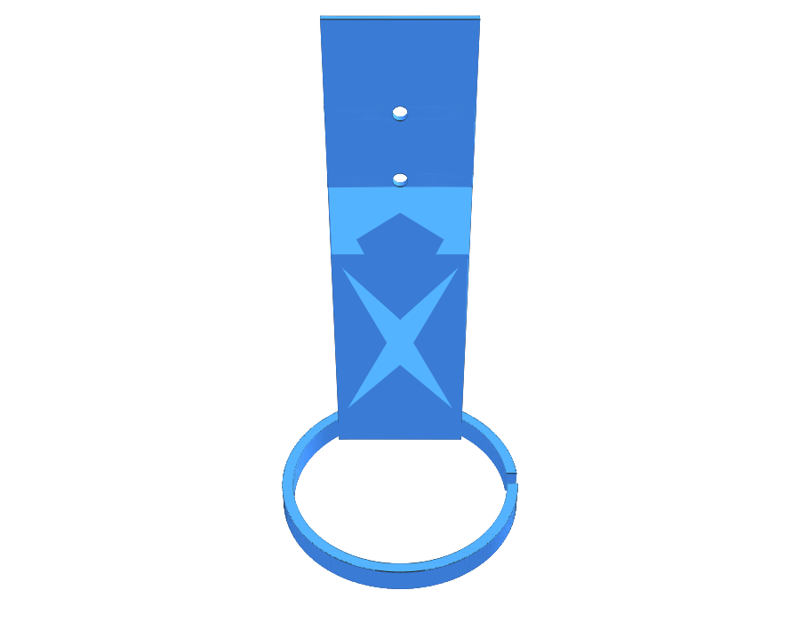

## Totemik Guts Coupler

### Overview

Straight coupler that joins 2 [`totemik-guts.jscad`](./totemik-guts.jscad)
pieces end to end: `totemik-guts` → `totemik-guts-coupler` →
`totemik-guts`. Same beam cross-section as totemik-guts' own beam
(`27 x 2.5mm`), kept full depth along the middle. At each end, a
`50 mm` section is thinned down and gets 2 holes — this nests with a
totemik-guts beam's own thinned top end, using exactly the lap-joint
mechanism totemik-guts already uses for its own `beamNotchSide` halves,
then bolts through the 2 aligned holes.

### Geometry

- Length: `130 mm`
- Beam cross-section: `27 x 2.5 mm`, matching totemik-guts.jscad's
  `BEAM_WIDTH` / `BEAM_DEPTH`
- Each end: `50 mm` long recess, thinned to `1.25 mm` (matching
  totemik-guts.jscad's `BEAM_DEPTH_TOP`), flush with one edge — the side
  complementary to totemik-guts' default `beamNotchSide: 'inner'`, so
  this coupler is designed to mate with totemik-guts pieces left at that
  default setting. `50 mm` matches totemik-guts.jscad's thinned top
  half exactly (`BEAM_HEIGHT / 2`), so the recess fills the guts beam's
  own recess over its *entire* length, not just the short stretch around
  the holes — leaving `30 mm` of full-depth material in the coupler's
  middle between the 2 recessed ends. (Earlier versions used a `20 mm`,
  then a `35 mm` recess; both were shorter than the guts' full `50 mm`
  recess, so part of it went unfilled by the coupler.)
- 2 holes per end, `3 mm` diameter, `±7 mm` apart (matching
  totemik-guts.jscad's `HOLE_DIAMETER` / `HOLE_OFFSET_Z`), positioned so
  they land exactly on totemik-guts' own hole positions (`18 mm` and
  `32 mm` from its beam tip) once the recess is butted flush against
  that tip

Assembly verified by unioning a totemik-guts piece with the coupler,
translated to butt the coupler's recess flush against the guts beam tip
(both in Z and in Y, to align the 2 parts' differently-offset beam
cross-sections) — the result is one continuous, connected beam. Probing
both hole positions with a `1.4 mm`-radius bolt-shaft cylinder confirms
each passes through cleanly (no collision with either layer); probing
several points across the full `50 mm` recess (including the midpoint
between the holes) confirms solid, overlapping material everywhere in
that span — i.e. both hole pairs coincide and the coupler's recess fully
fills the guts beam's own recess, with no gap or unfilled stretch.

### Source

- JSCAD: [`totemik-guts-coupler.jscad`](./totemik-guts-coupler.jscad)
- OpenJSCAD: [Open `totemik-guts-coupler.jscad`](https://openjscad.xyz/?uri=https://raw.githubusercontent.com/sponnet/ai-3d-designs/refs/heads/main/designs/totemik/totemik-guts-coupler.jscad#)

### Outputs

- STL: [`totemik-guts-coupler.stl`](./totemik-guts-coupler.stl)
- PNG preview: [`totemik-guts-coupler.png`](./totemik-guts-coupler.png)

### Preview

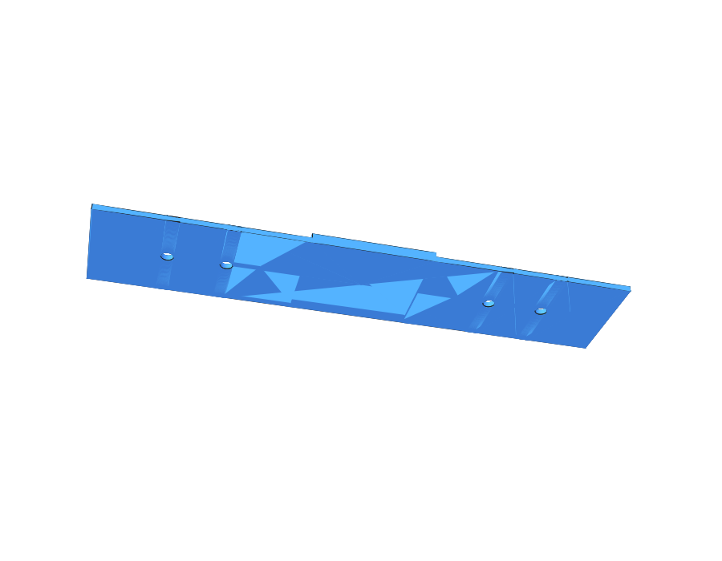

## Bottom Plug

### Overview

Push-fit foot for the bottom of a tube: a short plug that fits up inside
the tube's bottom opening, with a shallow rounded foot below it that ends
up touching the ground once installed. The whole piece is a hollow
shell, not solid. The foot is a shallow spherical cap rather than a full
hemisphere — flat across its whole diameter, bulging only a little at
its center. A relief slot cut through the plug's wall lets it flex a
little if the push-fit ends up too tight. Modeled with the foot at
`Z < 0` (dome pointing down, flat equator face at `Z = 0`) and the plug
at `Z > 0`, matching the piece's physical orientation once installed —
for printing, reorienting plug-side-down in the slicer gives a flat base
and a self-supporting dome with no overhangs. A separate exploration,
unrelated in dimensions to the Ring/Partition/Totemik Guts above.

### Geometry

- Tube inner diameter: `49 mm`
- Plug diameter: `48.6 mm` (`0.4 mm` push-fit clearance — assumed, not
  specified; adjust `PLUG_CLEARANCE` for a tighter/looser fit)
- Plug height: `6.67 mm` (`20 / 3` — 1/3 of the original assumed `20 mm`)
- Plug tip: `2 mm` tall lead-in chamfer, shrinking `2 mm` off the
  diameter, to ease insertion (assumed)
- Foot: a shallow spherical cap, `52 mm` across (a bit larger than the
  `49 mm` tube, for margin) and only `10 mm` deep at its center —
  computed from a much larger sphere (radius ≈ `38.8 mm`) so the curve
  is gentle, not a hemisphere's full curvature
- Wall thickness: `3 mm`, uniform through both the plug and the foot cap
  (concentric inner surface, offset inward by `3 mm` along the same
  sphere center for the foot, and by `3 mm` radius for the plug)
- Relief slot: `2 mm` wide (assumed), cut radially through the plug's
  wall along its full height, from the hollow cavity out past the outer
  surface — gives the plug wall a little compliance if the tube's actual
  bore ends up tighter than the assumed `0.4 mm` clearance

### Source

- JSCAD: [`bottom-plug.jscad`](./bottom-plug.jscad)
- OpenJSCAD: [Open `bottom-plug.jscad`](https://openjscad.xyz/?uri=https://raw.githubusercontent.com/sponnet/ai-3d-designs/refs/heads/main/designs/totemik/bottom-plug.jscad#)

### Outputs

- STL: [`bottom-plug.stl`](./bottom-plug.stl)
- PNG preview (isometric): [`bottom-plug-iso.png`](./bottom-plug-iso.png)
- PNG preview (front): [`bottom-plug-front.png`](./bottom-plug-front.png)

### Preview

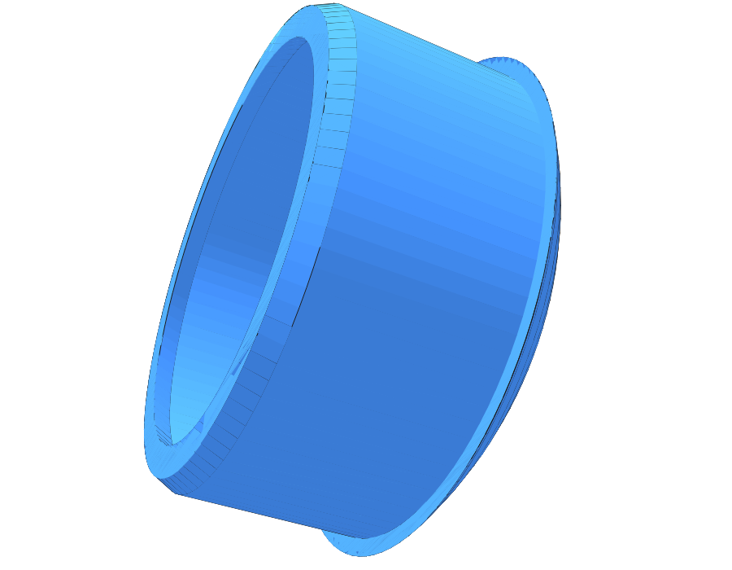
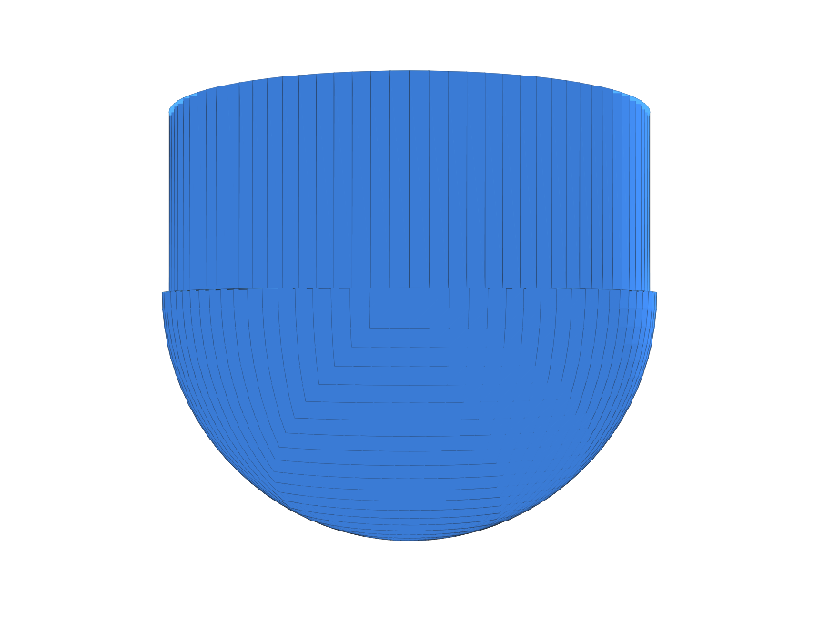

## Keypad

### Overview

Minimalist hollow beam, open only on the bottom, with 4 Cherry MX switch
cutouts side by side in the top wall — raising the switches up on the
beam's 4 closed sides (2 lengthwise side walls, 2 end walls), so there's
clearance underneath for switch pins / hot-swap sockets / wiring instead
of them sitting flush on whatever this is mounted to. The beam's width
tapers with height — `14 mm` at the bottom, flaring out to `18 mm` at
the top — so there's more wall material right around the switch cutouts
at the top, where it matters most structurally, while staying compact at
the bottom. The taper finishes 1 top-wall-thickness below the very top,
flush with the top wall's underside, so the top wall (already full
width) sits flush on an already-full-width wall beneath it — no
overhanging ledge at the top edge. 2 half-round mounting ears, each with
a `3 mm` screw hole, stick out from the 2 lengthwise ends for screwing
the whole keypad onto something. Hole spacing and top-wall thickness
match the standard Cherry MX plate spec measured from the reference
`3MechanicalButtons.3mf` (14x14mm nominal square cutout, 1.8mm plate);
the printed cutout itself is shrunk very slightly below that nominal
size for a snugger push-fit, since switches sat loose and popped back
out at the exact nominal 14mm. A separate exploration, unrelated in
dimensions to the other parts in this folder.

### Geometry

- 4 square cutouts, `13.8 x 13.8 mm` each (`14 mm` nominal minus a
  `0.2 mm` push-fit reduction, assumed), spaced `19.05 mm`
  center-to-center on the nominal `14 mm` grid (the standard MX/1u-keycap
  pitch, so keycaps don't collide), cut through the top wall
- Beam footprint: `79.15 mm` long (keeps the original `4 mm` margin
  beyond the outer hole edges left/right, unaffected by height); width
  tapers from `14 mm` at the bottom (`z = 0`) to `18 mm`, flaring outward
  symmetrically. The taper reaches full width at `z = 10.2 mm`
  (`BEAM_HEIGHT - TOP_THICKNESS`, the top wall's underside) and then
  stays constant through the top wall's own `1.8 mm` thickness up to
  `z = 12 mm` — not tapering all the way to the very top face, which
  would otherwise leave the top wall's edges overhanging past a
  still-narrower wall for that last `1.8 mm` of height
- Inner hollow: tapers too, from `13 mm` wide at the bottom to exactly
  `14 mm` (the nominal switch size — deliberately wider than the `13.8 mm`
  cutout above it, so the switch's actual body has full clearance even
  though the opening it clips through is tighter) at `z = 10.2 mm` —
  kept just wide enough for wiring/pin clearance throughout, while
  letting wall thickness stay a constant, compact `0.5 mm` at the bottom
  instead of pinching to `0 mm` (which a 14mm-wide bottom with a fixed
  14mm hollow would otherwise force)
- Top wall: `1.8 mm` thick (matches the measured Cherry MX plate spec),
  `18 mm` wide, giving `2 mm` margin beyond the (nominal) hole edges
  front/back
- Side walls (front/back, full beam length): taper from `0.5 mm` thick
  at the bottom to `2 mm` thick at `z = 10.2 mm` (then constant), both
  inner and outer faces sliding with height
- End walls (the 2 lengthwise ends): taper the same way in their Y
  extent up to `z = 10.2 mm` (matching the side walls' profile so
  everything stays flush), then a constant-`18 mm`-wide cap fills the
  remaining `1.8 mm` up to `z = 12 mm`, flush with the top wall; `2 mm`
  thick in X throughout (assumed, unaffected by the Y taper)
- Beam height: `12 mm` (assumed — how far "up" the holes sit, giving
  clearance underneath for switch pins/hot-swap sockets/wiring); only the
  bottom is open
- Mounting ears: one at each lengthwise end, half-round, `7 mm` radius
  (flat edge flush with the bottom's `14 mm` width, curved edge sticking
  outward), flush with the bottom edge, `2 mm` thick, each with a `3 mm`
  screw hole centered `3 mm` in from the curved outer edge (radius and
  hole inset assumed)

### Source

- JSCAD: [`keypad.jscad`](./keypad.jscad)
- OpenJSCAD: [Open `keypad.jscad`](https://openjscad.xyz/?uri=https://raw.githubusercontent.com/sponnet/ai-3d-designs/refs/heads/main/designs/totemik/keypad.jscad#)

### Outputs

- STL: [`keypad.stl`](./keypad.stl)
- PNG preview (isometric): [`keypad-iso.png`](./keypad-iso.png)
- PNG preview (top): [`keypad-top.png`](./keypad-top.png)

### Preview

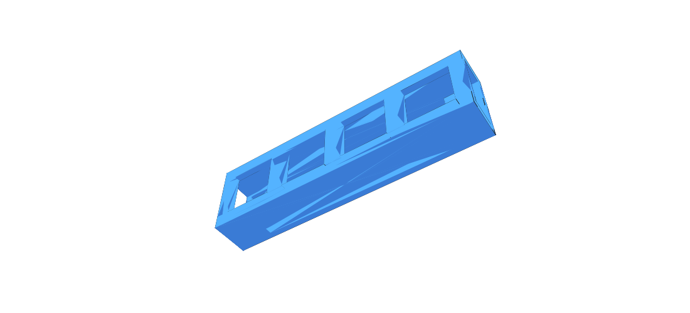
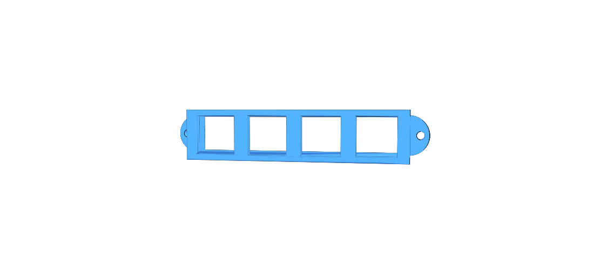

## Gear Ring

### Overview

Ring with 7 evenly-spaced square teeth sticking out radially, extruded
2mm, with a hollow-cylinder collar centered on it that runs all the way
down to the bottom (not just sitting on top). A separate exploration,
unrelated in dimensions to the other parts in this folder.

### Geometry

- Ring: inner diameter `45 mm`, outer diameter `51 mm`
- Teeth: `7`, evenly spaced (every `360/7 ≈ 51.43°`), each `7 mm` wide
  (tangential), sticking `10 mm` past the ring's outer edge (radial) —
  constant-width rectangular tabs, not wedges that widen with radius
- Each tooth is sunk in to the ring's *inner* radius (not just touching
  at the outer surface) — a solid overlap through the full ring wall for
  a strong printed bond, instead of a knife-edge tangent line
- V-shaped slot down the center of each tooth: `0 mm` wide where it
  starts at the ring's outer edge, widening to `2 mm` wide at the tooth's
  tip — cut clean through the tooth's height, splitting the protruding
  part into 2 prongs joined only at their sunk-in root inside the ring.
  Runs along the tooth's own radial line, centered tangentially in the
  tooth's `7 mm` width.
- Base (ring + teeth) extrusion height / first-layer thickness: `2 mm`
- Collar: hollow cylinder centered on the ring's axis, outer diameter
  `48.5 mm`, wall thickness `3 mm` (inner diameter `42.5 mm`) — its inner
  diameter is `2.5 mm` smaller than the base ring's `45 mm` bore, so
  there's a small internal step/lip where they meet. Runs from `Z = 0`
  (the very bottom, flush with the base) up to `Z = 7 mm` — `5 mm`
  above the base's own top surface (that `5 mm` rise is assumed — not
  specified in the brief).

### Source

- JSCAD: [`gear-ring.jscad`](./gear-ring.jscad)
- OpenJSCAD: [Open `gear-ring.jscad`](https://openjscad.xyz/?uri=https://raw.githubusercontent.com/sponnet/ai-3d-designs/refs/heads/main/designs/totemik/gear-ring.jscad#)

### Outputs

- STL: [`gear-ring.stl`](./gear-ring.stl)
- PNG preview (isometric): [`gear-ring-iso.png`](./gear-ring-iso.png)
- PNG preview (top): [`gear-ring-top.png`](./gear-ring-top.png)

### Preview

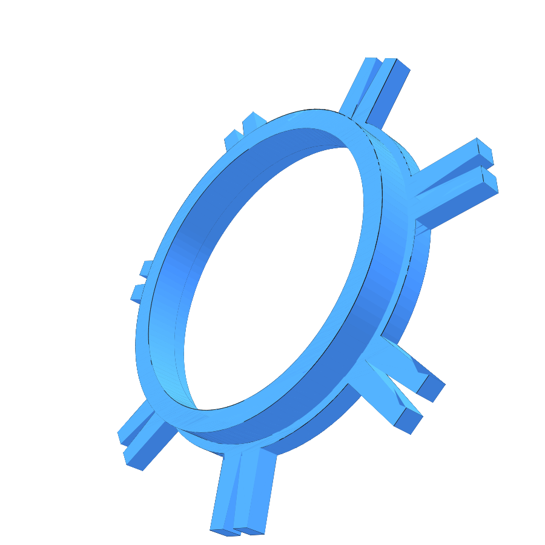
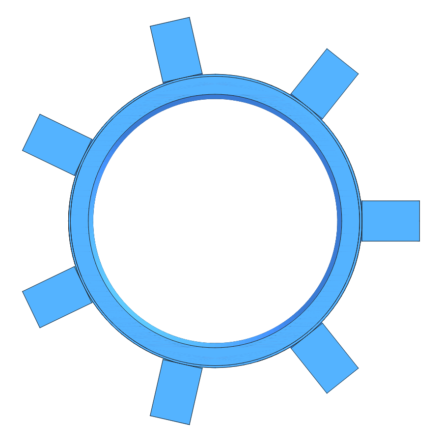

## Mic Holder

### Overview

Open-bottom tray for a microphone: a hollow box with 4 side walls and a
top wall, no bottom face, with 2 cutouts through the top — a round hole
for the microphone capsule near one end and a rectangular slot near the
other end. `35 x 15 x 17 mm` is the *interior* (cavity) size; the outer
box is that plus `2 mm` walls on every side (both sides of length/width,
and the top — the open bottom gets none added). Hole positions are
likewise measured within that same interior space. The vertical corners
are rounded the full height and the top edge is beveled, so no edge is
left sharp; a half-round mounting ear with a `3 mm` screw hole sticks out
from each end. A separate exploration, unrelated in dimensions to the
other parts in this folder.

### Geometry

- Interior (cavity): `35 x 15 mm` footprint, `17 mm` deep
- Walls: `2 mm` thick, all 4 sides plus the top
- Outer footprint: `39 x 19 mm` (`35 + 2×2` and `15 + 2×2`), `19 mm` tall
  (`17 + 2`, only the top adds thickness since the bottom stays open)
- Round hole: `4 mm` diameter, centered on the interior width, `7.5 mm`
  from the interior edge opposite the rectangular hole
- Rectangular hole: `12 x 9 mm`, centered on the interior width, flush
  with the interior edge opposite the round hole (touching the wall's
  *inner* face, never crossing into the wall itself, so it stays fully
  within the top surface with no overlap onto a side) — the `12 mm`
  dimension runs inward from that edge, the `9 mm` dimension across the
  width (assumed, not specified which dimension goes which way)
- The 2 holes are well clear of each other (a `13.5 mm` gap of solid top
  wall between them) and both stay clear of every wall
- Both cutouts pass through the `2 mm` top wall only
- Vertical corners: rounded with a `1.5 mm` radius (assumed — kept below
  the `2 mm` wall thickness so the wall never thins out at a corner) for
  the full height
- Top edge: beveled over the last `1.5 mm` of height, inset `1.5 mm`
  (both assumed) — removes the sharp edge where the flat top meets the
  sides, on top of the rounded vertical corners
- Mounting ears: one at each end, half-round, `7.6 mm` radius — `20%`
  narrower than the full `19 mm` exterior width (`9.5 mm`), so the ear's
  flat edge falls inside the box's rounded-corner recess at that end
  (the box's actual flat-edge width right at the very end is only
  `EXT_WIDTH - 2×CORNER_ROUND_RADIUS` = `16 mm`, not the full `19 mm`) —
  instead of overhanging past it. Curved edge sticking outward, flush
  with the bottom edge, `2 mm` thick, each with a `3 mm` screw hole
  centered `3 mm` in from the curved outer edge (hole inset assumed)

### Source

- JSCAD: [`mic-holder.jscad`](./mic-holder.jscad)
- OpenJSCAD: [Open `mic-holder.jscad`](https://openjscad.xyz/?uri=https://raw.githubusercontent.com/sponnet/ai-3d-designs/refs/heads/main/designs/totemik/mic-holder.jscad#)

### Outputs

- STL: [`mic-holder.stl`](./mic-holder.stl)
- PNG preview (isometric): [`mic-holder-iso.png`](./mic-holder-iso.png)
- PNG preview (top): [`mic-holder-top.png`](./mic-holder-top.png)

### Preview

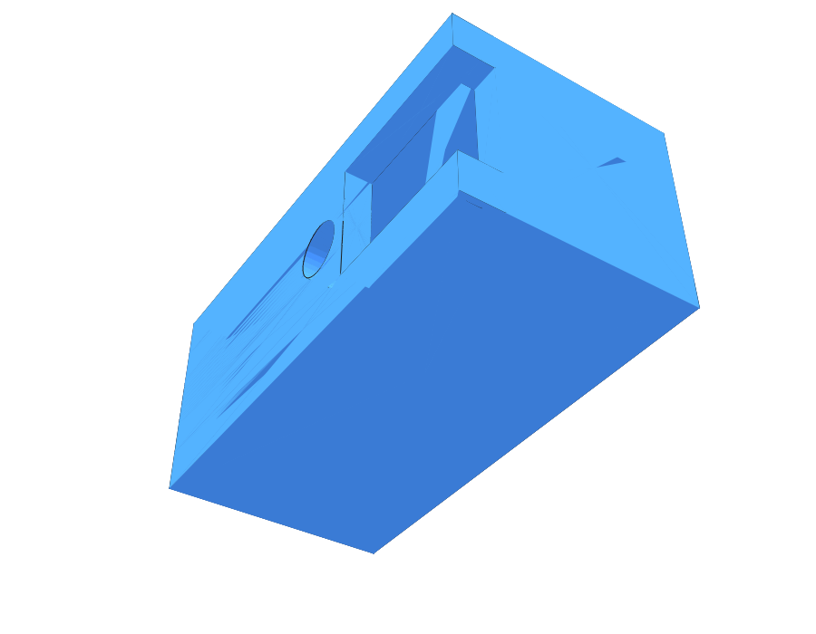
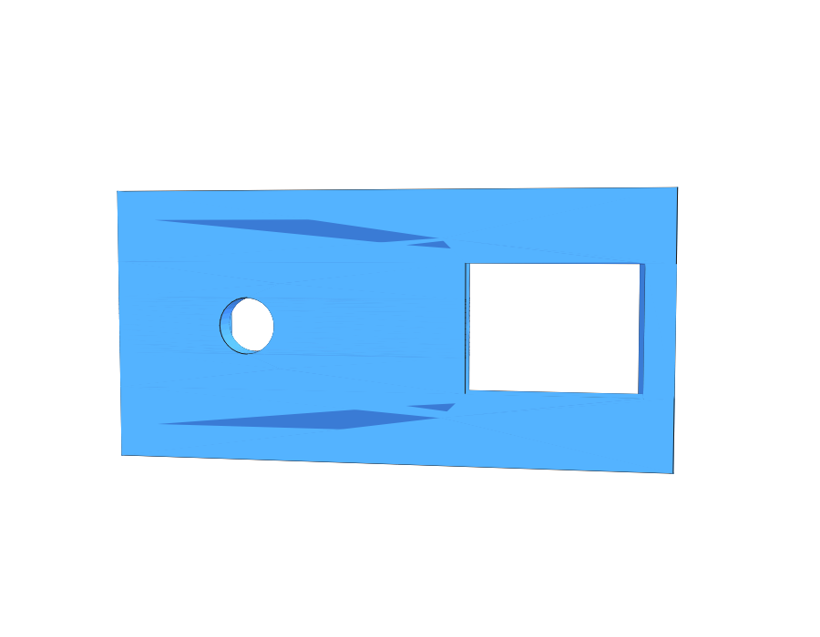

## Bottom Support

### Overview

Outer cylinder with 2 cutouts, split into 2 half-arcs for printing. An
earlier version of this part was a half-hollow torus (donut), but that
was too CPU-intensive to generate, so it was replaced with this
cylinder-based design. The first cutout is a centered recess that stops
`2 mm` short of the top, bottom and sides, giving a uniform `2 mm` wall
on every side over most of the height. The second is a narrower
through-hole running the *full* height — since it's narrower than the
recess, it only actually removes material at the 2 end caps the recess
leaves solid, so the result is a thin-walled tube with a thicker ring at
each end, open all the way through. 7 evenly-spaced notches are cut into
that top ring at its inner edge, like a scalloped or castellated
opening. The whole piece is cut in half through its central (X=0) plane,
since printing it as 2 separate half-arcs was easier than the full ring.
A `3 mm` hole goes radially through the wall at the angular middle of
one half, and each half carries a glue lip at both of its seam ends —
a rib that stays flush with (parallel to) the cutting plane, fully
recessed within its own half rather than crossing the seam, reaching
inward toward the cylinder's center. Both halves get the identical rib,
so the extra material meets and adds glue contact area beyond the bare
wall edge when the 2 flat seam faces are pressed together. A separate
exploration, unrelated in dimensions to the other parts in this folder.

### Geometry

- Outer diameter: `70 mm`
- Height: `50 mm`
- Wall thickness: `2 mm`, uniform on every side
- Recess (centered): `66 mm` diameter (`70 - 2×2`), `46 mm` tall
  (`50 - 2×2`) — leaves exactly `2 mm` of material radially and `2 mm`
  caps at both the top and bottom
- Through-hole: `51 mm` diameter, running the full `50 mm` height —
  narrower than the recess, so its only visible effect is punching
  through the `2 mm` end caps; combined with the recess this leaves a
  `9.5 mm`-thick ring (`70` to `51 mm` diameter) at each end and a `2 mm`
  wall (`70` to `66 mm` diameter) in between
- Notches: `7`, evenly spaced (every `360/7 ≈ 51.43°`) around the top
  ring's inner (through-hole) edge, cut through the ring's full `2 mm`
  height. `12 mm` wide tangentially (measured at the inner edge) and
  `3 mm` deep radially, reaching from the `51 mm` through-hole out to
  `57 mm` diameter — leaving `6.5 mm` of the `9.5 mm`-wide ring remaining
  past each notch
- Split in half through the X=0 plane (`CUT_RIGHT_HALF` in the source,
  a plain boolean — `true` keeps the `x<=0` half, `false` keeps `x>=0`)
  so it prints as 2 half-arcs instead of one full ring
- Radial hole: `3 mm` diameter, straight through the `2 mm` wall at the
  angular middle of the `x<=0` half (`x=-34mm, y=0`, pointing along -X,
  vertically centered). Fixed at that absolute position rather than
  computed per half, so it lands in only the `x<=0` piece — generating
  the other half simply doesn't reach that location
- Glue lips: at both of the wall's seam crossings (`y = ±35mm`, the
  outer edge where the X=0 cutting plane meets the wall), from the
  bottom up to `10 mm` short of the top (`40 mm` tall), reaching `6 mm`
  radially inward from the outer edge (toward the cylinder's center,
  down to `y = ±29mm`), `2 mm` deep in X — but recessed *into* its own
  half (`x` from `-2` to `0` for the `x<=0` half, `0` to `2` for the
  `x>=0` half) rather than crossing the seam. Identical on both halves
  (mirrored), so the 2 ribs meet flush when the flat seam faces are
  pressed together

### Source

- JSCAD: [`bottom-support.jscad`](./bottom-support.jscad)
- OpenJSCAD: [Open `bottom-support.jscad`](https://openjscad.xyz/?uri=https://raw.githubusercontent.com/sponnet/ai-3d-designs/refs/heads/main/designs/totemik/bottom-support.jscad#)

### Outputs

- STL: [`bottom-support.stl`](./bottom-support.stl)
- PNG preview (isometric): [`bottom-support-iso.png`](./bottom-support-iso.png)
- PNG preview (top): [`bottom-support-top.png`](./bottom-support-top.png)
- PNG preview (cross-section): [`bottom-support-cross-section.png`](./bottom-support-cross-section.png) —
  a thin slab through the axis; since slicing a cylinder through its own
  axis gives a rectangle (not a circle), this shows as a bracket-shaped
  profile — the thicker `9.5mm` end ring, the thinner `2mm` middle wall,
  and the `51mm` through-hole gap

### Preview

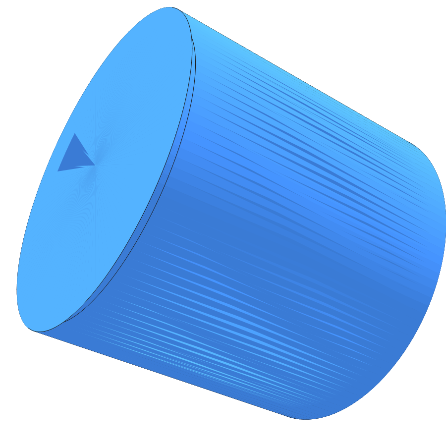
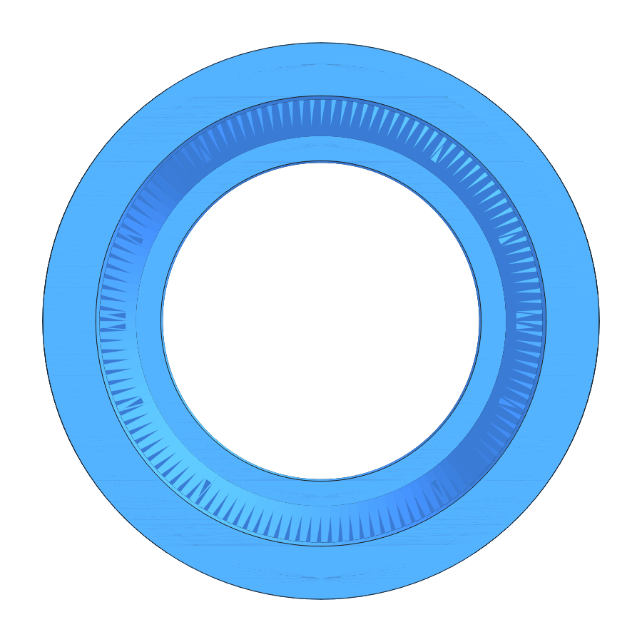
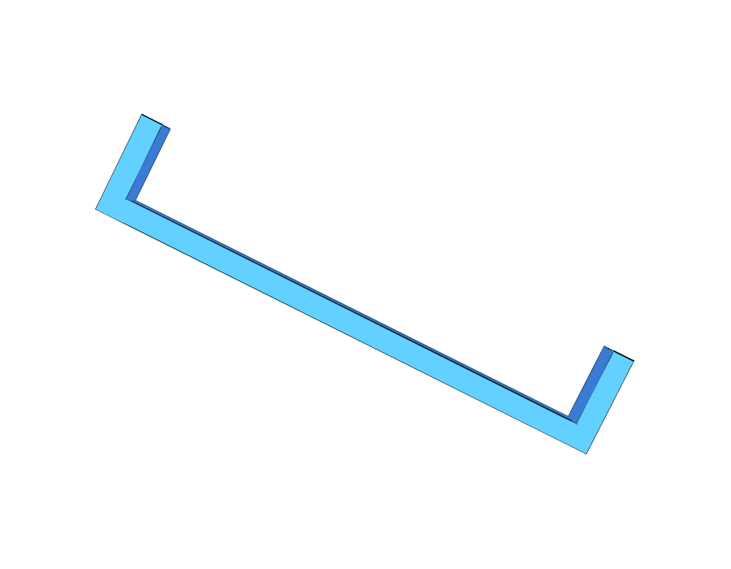
